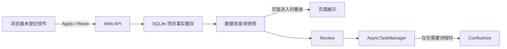

# Web 缓存与数据库缓存边界规则

## 目的

Web 页面、Web 后端进程和 SQLite 数据库必须各自只保存本层负责的状态。任何功能都不得为了方便，把数据库事实、页面状态、异步任务或筛选结果重复保存到另一层。

## 四类状态

| 状态 | 唯一所有者 | 生命周期 | 可以保存的内容 |
| --- | --- | --- | --- |
| 浏览器页面状态 | 前端页面 | 页面或当前浏览器会话；账号切换即失效 | 控件的未提交编辑值、按账号隔离且可丢弃的最后展示 payload、按钮状态、展示进度 |
| Web 运行时状态 | 后端进程内存 | 服务重启即失效 | `AsyncTaskManager` 任务、取消令牌、进度、轮询订阅、活跃同步任务 |
| 数据库事实缓存 | `smarttest-web.db` | 跨页面和服务重启 | Confluence/Jira 本地项目事实、详情、同步版本、资源授权状态 |
| 数据库查询快照 | `smarttest-web.db` | 由会话/清理策略管理 | 已解析筛选条件、结果项目 ID、事实缓存版本、创建时间 |

`user_preferences` 也是数据库状态，但它只保存用户偏好，例如筛选控件的已保存值；它不是查询结果，也不能直接作为审查范围。

## 必须遵守的规则

1. 前端不得保存审查、导出、批量操作等业务动作的权威项目 ID 列表。前端只能持有页面展示数据或后端返回的快照标识。
2. `BackgroundFactsRefresh` 和其他 Web 进程内对象只管理异步运行时状态。不得把筛选结果、业务选择集或需要跨重启使用的数据放入 `_jobs`、全局变量、模块变量或单例字段。
3. 数据库事实缓存是所有筛选的唯一数据源。读取缓存列表必须只查询本地数据库；除非请求明确标记为刷新/详情加载，否则不得访问 Confluence、Jira 或其他远端系统。
4. 需要“当前筛选列表”的业务动作必须使用数据库查询快照。快照由后端在成功返回本地缓存查询结果时创建或更新，记录筛选条件、搜索词、项目 ID 和事实缓存版本。
5. Review、导出和批量操作请求只提交业务参数及快照标识；后端必须校验快照属于当前会话并从快照取得项目 ID。不得接受前端直接提交的项目 ID 作为权威范围。
6. 用户只修改控件但没有触发查询或 Apply 时，不得改变已有快照。下一次成功的缓存查询或 Apply 完成后才替换快照。
7. Apply 的职责是为已筛选项目加载或刷新详情。它必须使用当前数据库查询快照确定范围；它不是创建筛选结果的前置条件。
8. 数据库事实版本变化后，旧快照必须按版本策略处理：同一事实版本可直接复用；版本不一致时由后端重新从数据库执行同一筛选并更新快照，不能静默改用全量项目。
9. 会话注销、过期或删除时，必须清理该会话的查询快照。数据库清理任务也必须清理超期快照。
10. Web 进程重启后，活跃任务可以取消或消失；数据库事实和有效查询快照必须仍可被重新读取。不得依赖进程内存恢复业务范围。
11. 页面重新进入时必须读取当前会话最后一个有效数据库查询快照并立即展示；不得先用空条件覆盖快照或清空已展示结果，也不得因为进入页面自动启动远端详情任务。
12. Apply 必须先按当前控件条件查询 SQLite 并创建或更新当前会话快照，再从该数据库快照读取筛选条件和项目 ID 启动详情任务。Review、Download 和其他后续动作继续只认同一服务端快照，禁止信任前端项目 ID 或静默扩大范围。
13. Reset 必须清空已应用的字段筛选和搜索条件，以账号授权 catalog 范围从 SQLite 重建当前会话快照；不得从刚才的过滤结果推导授权边界。
14. 固定页面结构与授权结果分离。Projects 对每个账号始终返回并展示 Core `PRODUCT_LINES` 的四个完整名称产品线容器；权限只影响容器内容和 Product Space 筛选候选。
15. 多 HTML 页面导航可在当前浏览器会话按账号保存一份可丢弃的最后展示 payload。重新进入时先同步渲染该 payload，再后台读取 SQLite 会话快照原位校准；校准失败保留旧展示并明确提示。该 payload 不是查询快照，Apply、Review、Download 或批量动作不得读取其中的项目 ID；全局认证会话 owner 必须在账号切换或注销时清理所有此类展示键，不能依赖对应业务页面处于挂载状态。
16. 同一页面生命周期内，同一 preference scope 的并发 hydrate 必须复用一个在途 GET；返回值仍只写入既有 preference store，不得形成第二份偏好缓存。

## Web 查询页面流程

- 页面进入时：若有账号隔离的可丢弃展示 payload，先同步渲染，随后读取当前会话最后一个有效查询快照并从 SQLite 原位校准；没有展示 payload 时显示 Loading，没有数据库快照时才以账号授权 catalog 范围建立初始快照。进入页面不启动远端详情任务。
- 用户偏好只恢复控件值，不改变已展示快照；控件值只有在 Apply 后才成为已应用筛选。
- Apply 时：先按当前控件值查询 SQLite 并更新当前会话快照，再从该快照确定项目范围并异步加载详情；完成后按同一筛选更新快照。
- Reset 时：清空已应用字段筛选和搜索，以账号授权 catalog 范围从 SQLite 重建快照；固定产品线容器保持不变。
- Review 时：只读取当前会话的查询快照并审查其中项目；不重新 Apply，不依赖前端旧列表，不使用全量项目兜底。

## 当前实现

Confluence 已使用 `web_query_snapshots` 保存会话查询快照。`PersistentSessionStore` 是该表唯一的 schema/migration owner；查询快照 repository 只负责数据读写。

`BackgroundFactsRefresh` 只保存同步任务的状态、进度、取消和任务标识，不保存筛选条件或项目 ID。服务重启后，Review 从 SQLite 查询快照恢复范围。

## 验收清单

- 服务重启后，登录同一有效会话仍能从数据库得到相同筛选范围。
- Review 请求中伪造或过期的项目 ID 不影响实际范围。
- 仅改控件、不查询时，Review 范围保持上一次数据库查询快照。
- 从本地缓存查询不会产生远端 HTTP 请求或详情加载任务。
- Apply、Review、导出均能追溯到同一个快照 ID、筛选条件和事实缓存版本。
- 页面重新进入立即重放最后一个有效会话快照，且不发起远端详情加载。
- Reset 后快照的筛选与搜索为空，范围恢复为当前账号授权 catalog，固定展示容器不变。
