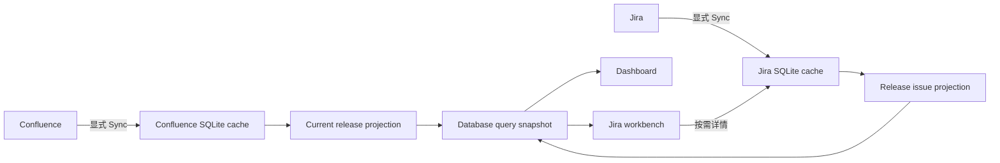

# Web 项目版本驾驶舱与 Jira 工作台设计

## 1. 背景与目标

SmartTest Web 当前的 Dashboard 主要展示 Wi-Fi 性能图，Jira 页面主要提供手工 JQL/Issue URL/Filter URL 审查，两者之间缺少共同的项目交付主轴。Confluence 已维护项目事实、阶段、目标和角色，Jira 已维护任务与缺陷，SmartTest 已分别把两类数据缓存到 SQLite，但尚未形成面向项目版本的统一查询和下钻体验。

本设计以“当前项目交付版本”为主轴：

- Dashboard 回答“哪些项目版本存在交付风险，原因是什么”；
- Jira 页面回答“这个版本为什么存在风险，具体问题和责任人是谁”；
- Projects 继续拥有项目主数据展示；
- Test/Reports 继续拥有测试结果和性能证据展示；
- Dashboard 与 Jira 只聚合已有事实，不成为第二个项目、Issue 或测试数据 owner。

## 2. 已确认范围

### 2.1 本次包含

- 每个 Confluence 项目展示一个当前交付版本；
- Confluence 项目事实与 Jira Issue 通过 `Project ID` 精确关联；
- Dashboard 展示版本组合、健康度和可解释风险；
- Jira 页面展示版本范围内的 Issue 列表、筛选和按需详情；
- Dashboard 向 Jira 下钻时复用服务端查询快照；
- 现有 Jira 确定性 Review、Cancel 和 Download 行为保留并移入高级审查区域；
- 页面和组件沿用现有 `smarttest-theme.css`、Light/Dark Theme 与响应式规则；
- 页面进入只读 SQLite，只有显式 Sync/Apply 流程可访问远端系统。

### 2.2 本次不包含

- 历史多版本管理、版本创建或人工编辑界面；
- Jira Summary/Description 中版本文本的模糊解析；
- 版本别名自动推断；
- 测试通过率、测试计划完成率和性能退化进入首期健康度；
- 预测发布日期、AI 风险评分或用户自定义健康度公式；
- 修改 Confluence、Jira 或测试系统中的远端数据；
- 改变 Projects、Jira Review、报告导出和现有 Wi-Fi 性能计算规则。

## 3. 外部系统事实分布

### 3.1 Confluence

Confluence 是项目与当前交付版本信息的唯一事实来源。

| 展示数据 | Confluence 字段 | 当前 SQLite owner |
| --- | --- | --- |
| 产品线 | Product Space | `confluence_projects` |
| 项目名称 | Project Status Report 页面 | `confluence_projects` |
| 项目标识 | Project ID | `confluence_projects` |
| 项目状态 | Project Status | `confluence_projects` |
| 当前阶段 | Current Stage | `confluence_projects` |
| Support Mode | Support Mode | `confluence_projects` |
| ODM/OEM、Key Part Number | 项目字段 | `confluence_project_fields` |
| 当前交付版本名 | Launch OS | `confluence_project_fields` |
| 项目负责人 | Project Owner | `confluence_project_owners` |
| Major FAE SW/HW/QA/PM | Window / Roles | `confluence_project_roles`、`confluence_project_role_people` |
| 状态摘要 | Status Summary | `confluence_project_fields` |
| 当前硬件阶段 | Current HW Stage | `confluence_project_fields` |
| MP 日期 | MP Time | `confluence_project_milestones` |
| 目标发布日期 | Launch Time | `confluence_project_milestones` |
| 当前目标 | Next Target | `confluence_project_milestones` |
| 当前目标日期 | Next Target Date | `confluence_project_milestones` |
| 页面来源与版本 | Catalog/Detail page metadata | `confluence_project_evidence` |

### 3.2 Jira

Jira 是任务、缺陷、版本填写状态和处理状态的唯一事实来源。

| 展示数据 | Jira 字段 | 当前 SQLite owner |
| --- | --- | --- |
| Key、Summary | 标准字段 | `jira_issues` |
| Issue Type | 标准字段 | `jira_issues` |
| Status、Resolution | 标准字段 | `jira_issues` |
| Priority | 标准字段 | `jira_issues` |
| Project | Jira Project | `jira_issues` |
| Component | Component/s | `jira_issue_components` |
| Labels | Labels | `jira_issue_labels` |
| Assignee、Reporter、Creator | 人员标准字段 | `jira_issues` |
| Created、Updated、Resolved | 时间标准字段 | `jira_issues` |
| Project ID | 自定义字段 | `jira_issue_custom_fields` |
| Software Release | 自定义字段 | `jira_issue_custom_fields` |
| Severity、Compare Status | 自定义字段 | `jira_issue_custom_fields` |
| QA Assignee、Manager | 自定义字段 | `jira_issue_custom_fields` |
| Affects Version/s、Fix Version/s | Jira 版本字段 | 当前需增加稳定投影 |
| Description、Comments、Attachments、Links | 详情字段 | 已有详情表，继续延迟加载 |

Jira 自定义字段 ID 必须由现有 Jira 字段元数据 owner 按字段名称解析。Web 层不得硬编码 `customfield_XXXXX`。

## 4. 当前交付版本定义

首期每个 Confluence 项目最多产生一个当前交付版本，字段定义如下：

| 版本属性 | 唯一来源 |
| --- | --- |
| 项目 | Confluence Project ID |
| 版本展示名 | Launch OS |
| 目标发布日期 | Launch Time |
| MP 日期 | MP Time |
| 当前阶段 | Current Stage |
| 当前硬件阶段 | Current HW Stage |
| 当前目标 | Next Target |
| 当前目标日期 | Next Target Date |
| 项目状态 | Project Status |
| 状态摘要 | Status Summary |

缺失字段必须显式展示：

- `Launch OS` 为空时显示“版本未填写”；
- `Launch Time` 为空时显示“目标日期未填写”；
- 不使用 MP Time、planned closure 或其他日期替代 Launch Time；
- 不从项目标题、Jira Summary 或 Description 推导版本。

## 5. Jira Issue 归属规则

### 5.1 项目关联

唯一允许的项目连接规则为：

```text
Confluence Project ID == Jira 自定义字段 Project ID
```

只进行首尾空白清理、Unicode 正规化、大小写无关比较和连续空白折叠。不得使用标题、芯片型号、客户名或 Issue 文本进行模糊匹配。

### 5.2 版本分类

关联到项目的 Jira Issue 分为：

1. **精确归属**：`Project ID` 一致，且 `Software Release` 或任一 `Fix Version/s` 与当前交付版本名匹配；
2. **版本待确认**：`Project ID` 一致，但版本字段为空或与当前交付版本不匹配。

版本待确认 Issue：

- 不进入精确版本完成率；
- 在 Dashboard 和 Jira 页面单独计数；
- P0/P1 仍参与风险判断，避免严重问题被静默遗漏；
- 页面必须解释其归属依据和待确认原因。

## 6. 健康度规则

首期只使用确定性规则，不计算综合分数。状态优先级为：

```text
BLOCK > WARNING > DATA INCOMPLETE > NORMAL
```

### 6.1 BLOCK

满足任一条件：

- Confluence Project Status 为 `BLOCK`；
- 当前项目存在未解决 P0。

### 6.2 WARNING

未进入 BLOCK 且满足任一条件：

- Confluence Project Status 为 `WARNING`；
- Launch Time 已经过期；
- Next Target Date 已经过期；
- 存在未解决 P1；
- 存在版本待确认的 P0/P1。

### 6.3 DATA INCOMPLETE

未进入 BLOCK/WARNING 且满足任一条件：

- Project ID 缺失；
- Launch OS 缺失；
- Launch Time 缺失；
- Jira 必要字段元数据不可用；
- 当前缓存尚未形成完整查询结果。

### 6.4 NORMAL

不满足以上状态时为 NORMAL。界面必须同时返回并展示触发原因，不允许只展示颜色或不可解释分值。

Jira “未解决”以 Resolution 是否为空为准，不在聚合服务中硬编码各项目的 Closed/Done/Verified 状态名称。

## 7. Dashboard 页面

### 7.1 页面职责

Dashboard 是跨项目版本的组合视图，负责发现风险和进入具体项目；不直接执行 Issue 编辑、Review 或测试报告分析。

### 7.2 筛选区

- Product Line；
- Current Stage；
- Project / Project ID；
- 当前交付版本；
- Project Owner / Major FAE QA；
- Project Status；
- Apply、Reset、Sync。

筛选候选来自 SQLite。Product Line 固定展示 Core `PRODUCT_LINES` 的四个完整产品线容器，权限只影响容器内容与候选。

### 7.3 汇总指标

| 指标 | 计算规则 |
| --- | --- |
| 当前版本 | 当前数据库查询快照内有效项目数 |
| 阻塞 / 关注 | 按第 6 节健康度规则计数 |
| 开放 P0 / P1 | Resolution 为空且 Priority 为 P0/P1 |
| 数据不完整 | 版本名、目标日期、Project ID 或必要 Jira 字段缺失 |

### 7.4 版本健康度表格

每行展示：

- 项目名称、Project ID、Launch OS；
- Current Stage；
- Launch Time 和距离目标日期天数；
- 开放 Issue、P0/P1、版本待确认 Issue 数；
- Next Target、Next Target Date；
- Project Owner、Major FAE QA；
- 健康度和触发原因数量；
- Confluence/Jira 缓存更新时间。

选择一行后，右侧详情展示项目基本信息、当前目标、Status Summary、所有风险原因、Confluence 项目链接，以及“查看 Jira 问题”入口。

## 8. Jira 版本问题工作台

### 8.1 页面职责

Jira 页面负责解释当前版本风险，定位具体 Issue 和责任人；不拥有项目状态或版本目标日期。

### 8.2 三栏布局

左栏为筛选：

- Product Line、Project、Project ID；
- 当前交付版本、Jira Fix Version、Software Release；
- Status、Resolution、Priority、Severity；
- Component、Assignee、QA Assignee；
- 版本归属：精确/待确认；
- Apply、Reset、Sync 和“高级 JQL / 审查”。

中栏为服务端分页 Issue 列表：

- Key、Summary、Priority、Severity；
- Status、Assignee、Component；
- Software Release、Fix Version；
- Updated、版本归属状态。

默认按 Priority 后按 Updated 降序排列。

右栏为 Issue 详情：

- 首屏直接展示 Key、Summary、Status、Resolution、Priority、Severity、Project ID、Software Release、Fix Version/s、Component、Assignee、QA Assignee、Manager、Created、Updated、Resolved 和版本归属解释；
- Description、Comments、Attachments、Links、Root Cause 和 Compare Status 继续按需加载；
- “打开 Jira”只导航到源 Issue，不在 SmartTest 中修改远端 Jira。

### 8.3 现有 Jira Review

现有 JQL/Issue URL/Filter URL 审查放入“高级 JQL / 审查”区域，继续复用原有：

- Start Review；
- Cancel；
- Download；
- 异步任务进度和失败状态。

本次不得修改现有确定性规则、导出格式或任务生命周期。

## 9. SQLite 设计

### 9.1 复用现有 Confluence 缓存

项目原始事实继续由现有 Confluence 表保存，不建立第二套可编辑项目事实。

增加只读查询投影：

```text
project_current_releases
- confluence_id PRIMARY KEY
- project_id
- release_name
- launch_time
- mp_time
- next_target
- next_target_date
- current_hw_stage
- status_summary
- source_revision
- cached_at
```

该表随 Confluence 项目详情刷新重建，任何值都能追溯到原缓存字段。

### 9.2 Jira 聚合字段投影

增加：

```text
jira_issue_release_facts
- issue_id PRIMARY KEY
- project_business_id
- software_release
- severity
- compare_status
- qa_assignee_identity
- manager_identity
```

以及多值表：

```text
jira_issue_fix_versions
- issue_id
- version_id
- version_name
- released
- release_date
- PRIMARY KEY(issue_id, version_id, version_name)
```

原始 custom fields 继续保存在 `jira_issue_custom_fields`；投影仅服务稳定聚合查询，不成为新的业务事实来源。

### 9.3 查询快照

扩展现有数据库查询快照，记录：

- 筛选条件与搜索词；
- Project IDs；
- 当前版本标识；
- Confluence facts version；
- Jira cache version；
- 创建、更新时间和过期时间。

Dashboard、Jira 下钻、Review 和后续导出只接受快照标识，不能接受前端提交的权威 Project ID/Issue ID 集合。

## 10. 数据流与刷新



- 页面进入：重放当前会话最后一个有效 SQLite 查询快照；
- Apply：先按控件条件查询 SQLite 并更新快照；
- Reset：清空已应用筛选，按账号授权 catalog 重建快照；
- Sync：只刷新当前服务端快照范围；
- Confluence/Jira 刷新失败：保留已有缓存并明确标识 stale/failed；
- 不得因页面进入、筛选候选读取或本地分页访问远端系统。

## 11. API 设计

新增：

```text
GET  /api/dashboard/releases
POST /api/dashboard/releases/sync
GET  /api/dashboard/releases/{project_id}

GET  /api/jira/release-issues
POST /api/jira/release-issues/sync
GET  /api/jira/release-issues/{issue_key}
```

`GET /api/dashboard/releases` 返回 facets、summary、release rows、selected detail、query snapshot、source freshness 和 sync state。

`GET /api/jira/release-issues` 返回 selected release、facets、服务端分页 issue page、精确/待确认计数、query snapshot、source freshness 和 sync state。

现有 `/api/jira/issues*` 与 `/api/audits/jira*` 合同保持兼容。

## 12. 前端布局与风格

预计新增：

```text
web/frontend/src/release-dashboard.js
web/frontend/src/jira-workbench.js
web/frontend/src/release-health.js
```

预计修改：

```text
web/frontend/index.html
web/frontend/jira.html
web/frontend/src/main.js
web/frontend/src/jira-main.js
web/frontend/src/api.js
web/frontend/src/smarttest-theme.css
```

规则：

- 沿用现有 `.card`、`.button`、`.form-control`、`.report-*` 和主题变量；
- 不引入新 CSS 框架，不重做顶部导航；
- 新 CSS 只补充版本表格、健康度原因和 Jira 三栏布局；
- 820px 以下变为单列；
- 关键内容不依赖 hover；
- Light/Dark Theme 均通过现有变量呈现。

## 13. 执行清单

### 阶段 1：合同与 RED 测试

- 定义当前交付版本、Jira 发布字段和健康度原因模型；
- 定义 Dashboard/Jira API payload；
- 添加 Project ID 精确关联、版本待确认、缺失数据和健康度优先级测试；
- 添加禁止标题模糊匹配的回归测试。

### 阶段 2：SQLite 与同步

- 扩展 Jira schema 和缓存映射；
- 保存 Fix Version 和稳定 Jira 业务字段投影；
- 建立 Confluence 当前交付版本投影；
- 增加 Jira cache version；
- 扩展查询快照 source versions；
- 验证服务重启后查询范围和版本分类稳定。

### 阶段 3：Dashboard 查询服务与 API

- 实现版本聚合、健康度、筛选 facets 和选中详情；
- 实现当前服务端快照范围内的 Sync；
- 返回每项健康状态的明确原因；
- 验证伪造前端 Project ID 不改变快照范围。

### 阶段 4：Dashboard 页面

- 将 Dashboard 主业务调整为项目版本驾驶舱；
- 实现筛选、指标、表格和详情面板；
- 将现有 Wi-Fi 图表留在 Performance/Report 业务，不进入首期版本健康度；
- 验证页面重入、快照重放、响应式和主题切换。

### 阶段 5：Jira 工作台

- 实现三栏布局、分页、筛选和按需详情；
- 实现 Dashboard 到 Jira 的快照下钻；
- 把现有 Jira Review 移入高级区域；
- 验证 Review/Cancel/Download 合同未改变；
- 验证 Dashboard 计数与 Jira 下钻列表一致。

### 阶段 6：环境验收与清理

- 使用真实 Confluence/Jira 账号验证同步；
- 验证缺少 Fix Version 的项目；
- 验证不同账号权限、后端重启和远端失败；
- 清理临时日志、重复转换、探索性测试和废弃实现；
- 执行前端、后端聚焦测试和 `git diff --check`；
- Coco 确认功能完整后进行最终代码质量审查、清理和交付。

## 14. 验收标准

### Functional Acceptance

- Dashboard 能从 SQLite 展示账号授权范围内的当前项目版本；
- 每个健康状态都能展示确定性触发原因；
- Confluence Project ID 与 Jira Project ID 精确关联；
- 缺失或不匹配版本的 Issue 进入“版本待确认”，不被静默丢弃；
- Dashboard 向 Jira 下钻后数量和范围一致；
- Jira 详情继续按需加载；
- 页面进入不访问远端，Apply/Reset/Sync 遵守数据库快照边界；
- 现有 Jira Review、Cancel、Download 行为保持不变；
- Light/Dark Theme 和窄屏布局可用。

### Code Quality

- Confluence、Jira、版本聚合和页面状态分别只有一个清晰 owner；
- 不新增第二套 transport、缓存、项目事实或 Issue 事实；
- 不硬编码 Jira 自定义字段 ID；
- 不使用标题或文本模糊匹配项目版本；
- 无临时诊断、重复机制、未使用抽象或无关改动；
- 聚焦测试通过且 `git diff --check` 通过。

## 15. 交付方式

本需求跨 Confluence、Jira、SQLite、Web API 和前端，采用 Scheme B：Atlas 负责范围、设计和最终验收，Mason 负责目标代码调查、实现、清理和自测。实施前记录当前周配额；如实现中出现范围扩展、新业务决策或与本设计冲突的实际数据，停止修改并提交 Coco 确认。
